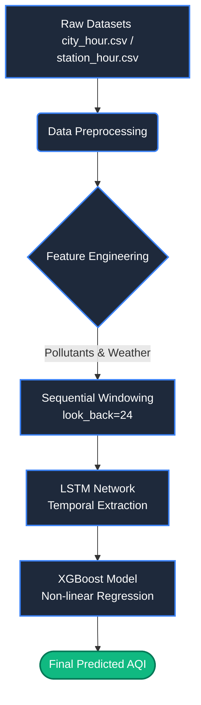

# Hybrid AQI Predictor Documentation Diagrams

Below are the architecture and flow diagrams generated for your thesis/project report. You can view these directly in your markdown editor, or copy the mermaid blocks into a tool like [Mermaid Live Editor](https://mermaid.live/) or Microsoft Word (using a Mermaid plugin) to export them as high-quality images.

---

### Figure 4.1: Flow Diagram of Hybrid AQI Prediction Model

---

### Figure 4.2: System Architecture of LSTM + XGBoost Model

```mermaid
flowchart LR
    subgraph Input
        X([Time-Series Sequence <br> Shape: 24 x 12])
    end

    subgraph LSTM Temporal Extractor
        L1[LSTM Layer <br> Units: 64, Return Sequences: False]
        L2[Dense Layer <br> Units: 32, Activation: ReLU]
    end

    subgraph XGBoost Regressor
        XG[Gradient Boosted Trees <br> Estimators: 200, Max Depth: 7]
    end

    subgraph Output
        Y([Continuous AQI Value])
    end

    Input --> L1
    L1 --> L2
    L2 -- Extracted Deep Features --> XG
    XG --> Y

    style Input fill:#334155,stroke:#94a3b8
    style LSTM Temporal Extractor fill:#1e1b4b,stroke:#8b5cf6
    style XGBoost Regressor fill:#064e3b,stroke:#10b981
    style Output fill:#7f1d1d,stroke:#ef4444
```

---

### Figure 4.3: Data Preprocessing and Feature Engineering Workflow

```mermaid
graph TD
    subgraph Data Cleaning
        M[Load Raw CSVs] --> N[Interpolate Missing Values]
        N --> O[Drop Invalid Rows/Cols]
    end

    subgraph Feature Engineering
        O --> P[Calculate AQI <br> using standard sub-indices]
        P --> Q[Fuse City Macro & Station Micro Data]
        Q --> R[MinMaxScaler <br> Normalize 0 to 1]
    end

    subgraph Sequence Generation
        R --> S[Group by StationId]
        S --> T[Rolling Window <br> Step: 1, Size: 24]
        T --> U[Train / Test Split <br> 80/20]
    end

    style Data Cleaning fill:#1e293b,stroke:#3b82f6
    style Feature Engineering fill:#1e293b,stroke:#a855f7
    style Sequence Generation fill:#1e293b,stroke:#f59e0b
```

